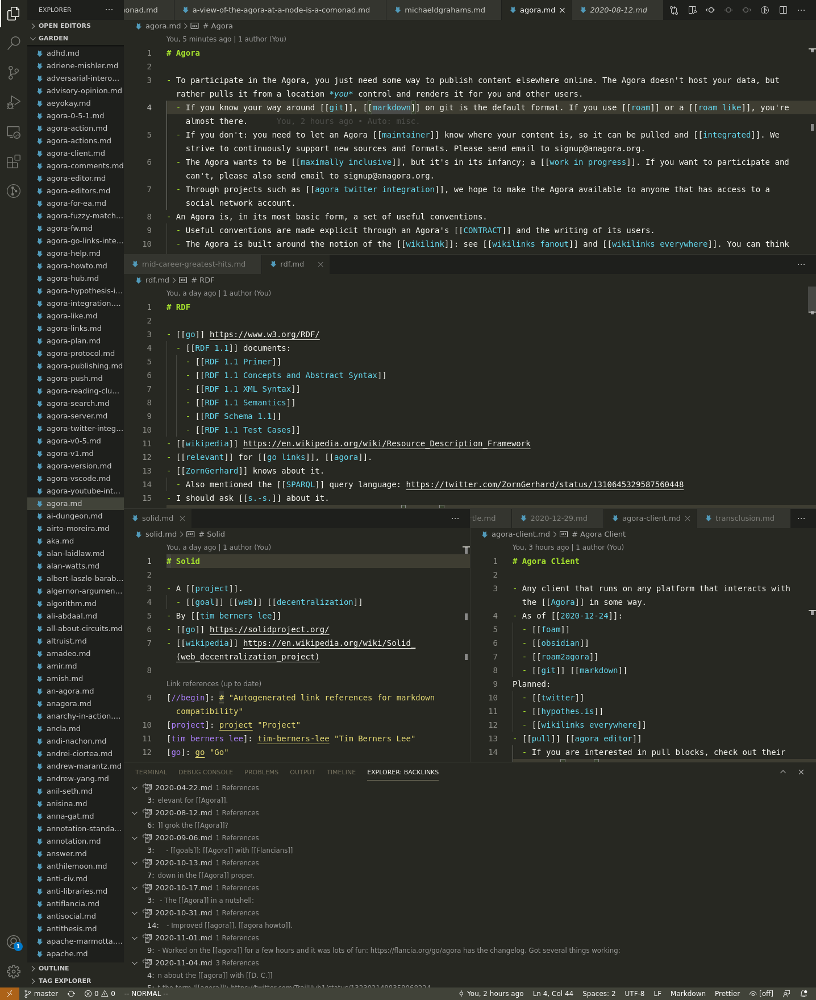

# How to use this Agora

## To browse it
The simplest way to read this Agora is to browse it online in https://anagora.org. If you browse it directly on [Github](https://flancia.org/go/agora-git), you'll find many links are broken (this will be fixed eventually).

## To contribute to it
The Agora is by design a distributed system. The easiest way to contribute to it is to:

1. Start taking public notes or public posts, that is, growing a "[digital garden](https://flancia.org/go/digital-garden)", and then
1. To ask for them to be included in the Agora's core repository.

You can also contribute directly to the "core" part of the Agora, that is, the "hub" [repository](https://flancia.org/go/agora-git) and the underlying [collaboration protocol](https://flancia.org/go/agora-protocol).

## Step one: grow a garden

There are many ways to grow a digital garden of your own; if you have one already, and would like for it to be mentioned here, please reach out or send a PR. The following is just the current recommended default.

The Agora currently targets [Foam](https://flancia.org/go/foam) as its main editor. Core to the distributed nature of the Agora is that every user is able to host their notes, their digital garden in a repository of their own, which they can maintain full control of. The current recommended hosting system is [git](https://flancia.org/go/git), which can be freely hosted in [Github](https://github.com) or [Gitlab](https://gitlab.com) among many others. Once their personal repository is up and running, users can send a "pull request" to the Agora so that it references their garden.



Once we get down to details, the Agora currently just checks out git repositories in a loop (this likely won't scale, but it might be good enough for the first few hundred users).

The next section detail how to get Foam or other Roam-likes running for the purpose of setting up a digital garden / note taking system compatible with the Agora; and information on how to go from other tools to achieving a similar outcome.

### Foam
Please refer to https://flancia.org/go/setting-up-foam. You should come back here once you have a git repository hosting your garden. If you run into any issues, please [reach out](https://flancia.org/go/twitter).

### Obsidian
Likely very similar to the procedure detailed above for Foam; hosting your garden in a git repository should get you most of the way there.

### Roam
Roam is currently not supported as an Agora editor. You can export your database to Markdown (warning: block references will not be preserved fully) and then import it into Obsidian or Foam. This is what I did and it yielded good results.

### Athens
Same as per the above, although I expect to prioritize direct Athens support as it's open source and Athens developers have expressed an interest.

## Step two: integrate your garden in the Agora
If you followed step one above, you should have a git repository of your own hosted in a place like Github. Its address should look like this: <https://github.com/username/repository>. 

### Option 1: send me your digital garden information
Once you have your garden published *somewhere* on the internet, ***please send an email to signup@anagora.org with the URL of your repository and your desired username*** and I'll integrate it into the Agora. Feel free to reach out to me also via [Twitter](https://twitter.com/flancian).

Currently the Agora can integrate a variety of Markdown-based gardens. If you have one in a different format, *please still reach out to me* so I can prioritize supporting new formats and sources :)

### Option 2: send a Pull Request integrating your garden
You do not need to do this -- I don't mind doing the above :)

I haven't tried the following end to end since last rewriting so they might not work for you off the bat. Please let me know if you run into any issues!

You can likely just copy/paste the following instructions if you are using the command line on a Unix-like OS (if you run into issues, please let me know):

```
$ USERNAME=flancian  # replace it with your own username.
$ GARDEN=https://github.com/$USERNAME/garden  # replace garden with the name of the repo for your digital garden.
```

First up, clone the Agora hub repository:

```
git clone git@github.com/flancian/agora.git
```

Then, create a branch and add your own garden as a subtree in the Agora repository:
```
cd agora
git subtree add --prefix agora/$USERNAME $GARDEN -b $USERNAME master --squash
```

Then, commit the addition (to your local repository) and send a PR to incorporate it into the main repository:

```
git commit -a -m "Adding $GARDEN by $USERNAME to the Agora"
git push origin $USERNAME
```

And send me (<https://github.com/flancian>) a [pull request](https://docs.github.com/en/free-pro-team@latest/github/collaborating-with-issues-and-pull-requests/creating-a-pull-request).